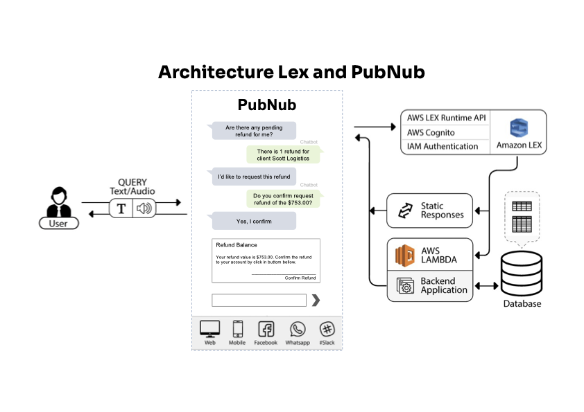

<!-- PROJECT LOGO -->
 

  

  <h3 align="center">Amazon Lex Build Conversation Bots with PubNub</h3>

  

    Conversational interfaces for your applications powered by the same deep learning technologies as Alexa with PubNub.
     
    <a href="https://www.pubnub.com/integrations/amazon-lex-build-conversation-bots/" target="_blank" rel="noopener"><strong>Explore the docs »</strong></a>
     
     
    <a href="https://www.pubnub.com/tour/introduction/" target="_blank" rel="noopener">View Demo</a>
  

<!-- ABOUT THE PROJECT -->
## About The Project

This projects uses PubNub chat feature with Amazon Lex integration to trigger actions like extend a reservation, request a refund, contact support. The Alexa use a dialog model to identify the prompts and user utterances to collect, validate, and confirm slot values and intents.

(<a href="#top">back to top</a>)

### Built With

This section list the major frameworks/libraries/services used to bootstrap this project.

* [AWS]()
* * [Alexa](https://developer.amazon.com/en-US/docs/alexa/smapi/send-a-message-request-to-a-skill.html target="_blank" rel="noopener")
* * * [Delegate Dialog](https://developer.amazon.com/en-US/docs/alexa/custom-skills/delegate-dialog-to-alexa.html){:target="_blank" rel="noopener"}
* * * [Validation Slot Values](https://developer.amazon.com/en-US/docs/alexa/custom-skills/validate-slot-values.html#configure){:target="_blank" rel="noopener"}
* * * [Interaction Model Scheme](https://developer.amazon.com/en-US/docs/alexa/smapi/interaction-model-schema.html){:target="_blank" rel="noopener"}
* * * [Add Card to the Reservation or Refund](https://developer.amazon.com/en-US/docs/alexa/custom-skills/include-a-card-in-your-skills-response.html){:target="_blank" rel="noopener"}
* * [Cognito](https://docs.aws.amazon.com/cognito/latest/developerguide/what-is-amazon-cognito.html){:target="_blank" rel="noopener"}
* * [IAM Policy for](https://aws.amazon.com/iam/){:target="_blank" rel="noopener"}
* * * AWSLambdaBasicExecutionRole
* * * AWSXRayDaemonWriteAccess
* * * AmazonDocDBReadOnlyAccess
* * * AmazonDocDBFullAccess
* * * AmazonDocDBConsoleFullAccess
* * [Lambda Function](https://docs.aws.amazon.com/lambda/latest/dg/welcome.html){:target="_blank" rel="noopener"}
* * * [VPC](https://docs.aws.amazon.com/lambda/latest/dg/configuration-vpc.html){:target="_blank" rel="noopener"}
* [PubNub Integration for Amazon Lex](https://www.pubnub.com/integrations/amazon-lex-build-conversation-bots/){:target="_blank" rel="noopener"}
* [Node.js](https://nodejs.dev/){:target="_blank" rel="noopener"}

(<a href="#top">back to top</a>)

